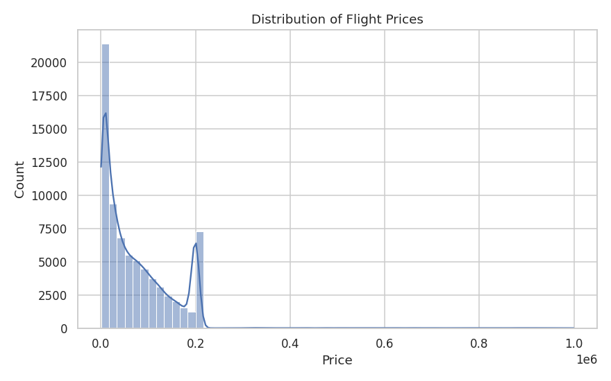
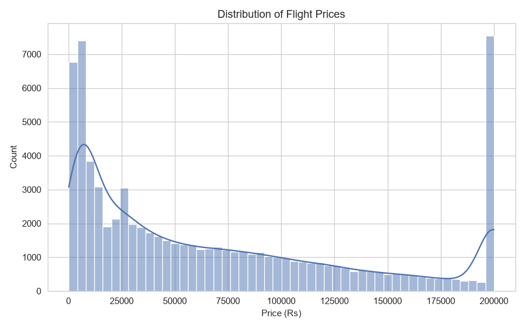

# AI Travel Analyst

**MIC AIML Department Recruitment Challenge — Data Science & Visualization**

## Project Overview

This is my submission for the AI Travel Analyst challenge, under the **Data Science & Visualization** track. The idea was pretty simple: take the given flight-price dataset, clean it up, see what actually affects the prices, and turn the results into something useful for a traveler.

I focused on the Exploration part of the challenge: cleaning the data, understanding it, visualizing the important patterns, and turning those patterns into clear conclusions. The main thing I wanted to demonstrate was not just that I could make charts, but that I could explain **why I made the decisions I made and what the data actually says**.

## Problem Statement

The main questions I wanted to answer were:

- Which factors have the biggest relationship with flight price?
- How much does travel class matter?
- Does booking earlier make a noticeable difference?
- How much do distance and duration matter?
- Are some routes consistently more expensive?
- Does the day of the week make much difference?
- Does the number of stops affect price?

The overall process was:

`Raw data → Cleaning → Analysis → Visualizations → Insights`

## Installation Instructions

Clone the repository:

```bash
git clone <your-repo-url>
cd <your-repo-name>
```

Create a virtual environment:

```bash
python -m venv venv
```

Activate it:

**Windows**
```bash
venv\Scripts\activate
```

**macOS / Linux**
```bash
source venv/bin/activate
```

Install the required packages:

```bash
pip install -r requirements.txt
```

Then run the cleaning script:

```bash
python clean_data.py
```

This creates:

```text
data/flight_price_clean.csv
```

Finally, generate the charts:

```bash
python build_visualizations.py
```

The charts will be saved in the `plots/` folder.

### Project structure

```text
AI-Travel-Analyst/
│
├── data/
│   ├── flight_pricing_dataset.csv
│   └── flight_price_clean.csv
│
├── plots/
│   ├── 01_price_distribution.png
│   ├── 02_price_vs_days_before_departure.png
│   ├── 03_price_by_class.png
│   ├── 04_price_v_stops.png
│   ├── 05_price_by_route.png
│   ├── 06_price_by_weekday.png
│   ├── 07_airline_class_heatmap.png
│   ├── 08_top_bottom_routes.png
│   └── 09_correlation_heatmap.png
│
├── inspect_data.py
├── clean_data.py
├── build_visualizations.py
├── requirements.txt
└── README.md
```

## Dataset Used

The project uses the flight-pricing dataset provided for the challenge. It contains around 100,000 synthetic flight records with information such as:

- Airline
- Source and destination
- Travel class
- Departure and arrival times
- Flight duration
- Number of stops
- Distance
- Days before departure
- Passenger count
- Booking channel
- Price

Dataset:

https://drive.google.com/file/d/1tNUDxjXHzbRXe8CQdIoyJWh8OweGW0rR/view?usp=sharing

Put the downloaded file here:

```text
data/flight_pricing_dataset.csv
```

> The dataset is synthetic, so the conclusions here describe patterns in this dataset rather than guaranteed real-world airfare behaviour.

## Methodology

The raw data needed quite a bit of cleanup before I could start comparing prices.

### Duplicate rows

Exact duplicates were removed.

### Inconsistent categories

Some categories appeared in different forms. For example:

```text
SpiceJet
SPICEJET
spicejet
```

These were standardized so they are treated as the same airline.

### Locations

The dataset mixes city names, airport names, and IATA codes. I mapped these to consistent city names so route analysis would not split the same location into multiple categories.

For example:

```text
MAA
Chennai Airport
Chennai
```

are all treated as:

```text
Chennai
```

### Number of stops
Values such as `0`, `non-stop`, `1`, `1 stop`, `2`, and `2 stops` were converted into numeric values.

### Passenger count
Passenger counts were sometimes written as words, such as `two` or `three`. These were converted to numbers.

### Duration
Flight duration appeared in more than one format. Values such as `5h 30m` and decimal-hour values were converted into minutes.

### Time
Departure and arrival times were converted into numeric hours. I also created a departure-period feature with:
- Morning
- Afternoon
- Evening
- Night

### Missing values
For categorical columns, missing values were kept as `Unknown` instead of dropping the entire row.
Rows missing important numeric values such as distance, days before departure, or passenger count were removed.

### Extreme prices
A small number of very high prices made the plots difficult to read. I removed prices above the 99th percentile for the exploratory analysis.
I kept this step explicit in the cleaning script rather than silently changing the data.

### Visualizations

I created 9 visualizations:

1. **Price distribution** — what the overall price distribution looks like.
2. **Price vs. days before departure** — how booking lead time relates to price.
3. **Price by travel class** — Economy vs Business vs First.
4. **Price vs. number of stops** — whether stops are associated with different prices.
5. **Price by route** — prices across the busiest routes.
6. **Price by weekday** — average price across the days of the week.
7. **Airline × class heatmap** — average prices for different airline/class combinations.
8. **Top and bottom routes** — the most and least expensive routes.
9. **Correlation heatmap** — relationships between price and the numeric variables.

### A few decisions I made

I tried not to treat the cleaning process as something separate from the analysis. A few decisions had a direct effect on the results.

**Why normalize locations?**
Because `MAA`, `Chennai Airport`, and `Chennai` should not become three separate locations when comparing routes.

**Why use `Unknown` for some missing categorical values?**
Dropping every row with a missing category would throw away data unnecessarily. Keeping `Unknown` makes the missing information visible while retaining the observation.

**Why remove the top 1% of prices?**
The extreme values stretched the plots so much that the main distribution became difficult to see. I used the 99th percentile as a simple, documented cutoff for this exploratory analysis.

**Why use correlation?**
It gives a quick numerical way to compare the relationships between price and the numeric variables. But I did not use it by itself. The booking-time example showed why the visual trend matters too.

## Technologies Used

- Python
- pandas
- NumPy
- matplotlib
- seaborn

## Results

### Airline makes a big difference
There is a large gap between the prices of different airline groups. In this dataset, premium international carriers can be around 3–5 times more expensive than budget carriers for the same class.

### Distance and duration are strongly related to price
Distance has a correlation of about **0.82** with price, while duration is about **0.80**.
That is also fairly intuitive: longer flights usually take more time and tend to cost more.
Distance and duration are also closely related to each other, so I would not treat them as two completely independent effects.

### Travel class matters
Business and First class fares are roughly **1.5–2 times** Economy fares in the data.

### Route matters
Long-haul international routes tend to be much more expensive than shorter domestic routes.

### Booking time was more interesting than the correlation suggested
The overall correlation between days before departure and price is only weakly negative.
But when I plotted the actual trend, the relationship was clearer: prices tend to drop noticeably over roughly the first 30 days before departure and then level off.
This was one reason I used both the charts and the correlation values instead of relying on correlation alone.

### Day of week is a smaller factor
The average price difference across weekdays is roughly 9%, which is relatively small compared with airline, distance, duration, class, and route.

### Passenger count did not show much of a relationship
Within this dataset, passenger count had little apparent relationship with the listed flight price.

### Main takeaway
The strongest practical takeaway from the analysis was booking time.
Within this dataset, **around 3–4 weeks before departure** looks like a reasonable booking window. Prices are generally higher closer to departure, while going much further in advance does not show the same additional benefit.

I would not treat this as a rule for real flights. It is simply the pattern that appeared in this dataset.

### Limitations

There are a few important limitations to this analysis:
- The dataset is synthetic.
- Correlation does not mean causation.
- Extreme prices were removed for visualization purposes.
- No prediction model has been built yet.
- The booking-time recommendation may not generalize to real airline pricing.

## Challenges Faced

The biggest challenge, honestly, was the raw data itself. It was mixed formats, missing values, duplicated categories, and several different ways of writing the same information — nothing about it could be trusted at face value, so most of the real work happened before any analysis could even start. ALso, I am a very beginner at coding. So yeah, it wasn't easy.

**The airline naming problem.** While building the airline × class heatmap, I noticed the same airline showing up multiple times under different capitalizations:
```text
SpiceJet
SPICEJET
spicejet
```
To me these are obviously the same airline. To pandas, they're three completely unrelated text values, since it compares strings exactly. If I hadn't caught this, the airline-level analysis would have quietly split real airlines into smaller fake pieces — the numbers wouldn't have been wrong exactly, just diluted and misleading. I fixed it by standardizing capitalization across the board so every variant collapses into one name.

**The outlier problem — and how I actually found it.** The first sign something was off wasn't in the numbers, it was in the plots: several charts were showing their price axis in scientific notation (`1e6`) instead of normal numbers. That only happens when matplotlib has to stretch the scale to fit a few values that are way outside the normal range. That was the clue that sent me looking closer, and sure enough, a small number of prices reached roughly ₹10,00,000 — not realistic for any actual flight. Left in, they were dragging every plot's scale out so far that the real, everyday price range got squeezed into a tiny sliver of the chart. I capped anything above the 99th percentile and treated it as noise rather than a real price. (See the before/after comparison in the Screenshots section below.)

Separately from that, I also noticed a real concentration of prices sitting almost exactly at ₹2,00,000 — a genuine pattern in the data rather than an error, likely a cap built into however this dataset was generated. I left this one alone and just noted it, since removing a real pattern would have been the wrong call.

**Version control was its own learning curve.** This was the first project where I actually used Git properly — incremental commits as I went, instead of one big upload at the end. Along the way I learned what `.gitignore` is actually for: telling Git to permanently ignore things like the `venv/` folder and cache files, since those are just installed libraries and temporary junk, not code I actually wrote.

## Future Improvements

If I continued this project, the next step would be to move from exploration into modeling.
I would like to:

1. Build a flight-price prediction model.
2. Engineer more useful features.
3. Compare model feature importance with the patterns found during EDA.
4. Use SHAP or a similar method to explain predictions.
5. Build a small Streamlit dashboard.
6. Test whether the 3–4 week booking pattern stays consistent across airlines, routes, and travel classes.
7. Replace some of the manual category mappings with automated matching.

## Screenshots (if applicable)

**Price distribution before vs. after outlier capping:**

| Before | After |
|---|---|
|  |  |
